# Agentic AI Ops Platform — Design & Implementation Plan

> **Goal**: Build a production-grade IT Operations AI assistant that teaches you every major Agentic Engineering concept through hands-on implementation. Simple code, deep concepts.

---

## Table of Contents

1. [What You'll Learn](#what-youll-learn)
2. [High-Level Design (HLD)](#high-level-design-hld)
3. [Low-Level Design (LLD)](#low-level-design-lld)
4. [Request Flow Diagrams](#request-flow-diagrams)
5. [Implementation Phases](#implementation-phases)
6. [Open Questions](#open-questions)

---

## What You'll Learn

Each implementation phase maps to real Agentic Engineering concepts:

| Phase | Concepts Covered |
|-------|-----------------|
| **Phase 1: Foundation** | FastAPI, SQLite, Pydantic schemas, project structure |
| **Phase 2: RAG Pipeline** | Document chunking, OpenAI embeddings, Qdrant vector search, retrieval strategies |
| **Phase 3: Agent Core** | LangGraph state machines, tool-calling agents, conditional routing |
| **Phase 4: Multi-Agent** | Supervisor pattern, agent handoff, intent detection, specialized agents |
| **Phase 5: Memory** | Short-term (conversation), long-term (persistent), semantic (vector) memory |
| **Phase 6: Human-in-the-Loop** | Approval workflows, LangGraph `interrupt()`, breakpoints |
| **Phase 7: MCP** | Model Context Protocol, tool servers, standardized tool exposure |
| **Phase 8: A2A Protocol** | Agent-to-Agent communication, Agent Cards, task lifecycle |
| **Phase 9: Auth & Production** | JWT, RBAC, rate limiting, error handling, logging |
| **Phase 10: Streamlit UI** | Chat interface, ticket management, document upload, admin panel |
| **Phase 11: Testing** | Pytest, agent mocking, integration tests, RAG evaluation |
| **Phase 12: Observability** | LangSmith tracing, audit logs, agent trace visualization |

---

## High-Level Design (HLD)

### System Context

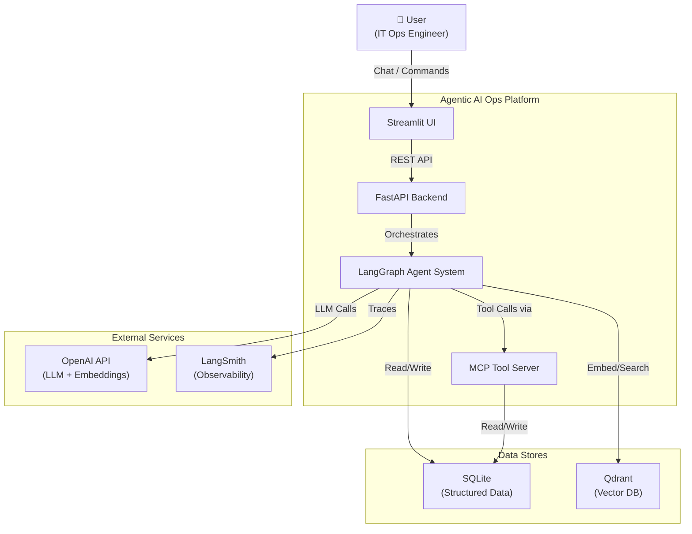

### Architecture Layers

```mermaid
graph LR
    subgraph Presentation["Presentation Layer"]
        Streamlit["Streamlit App"]
    end
    
    subgraph API_Layer["API Layer"]
        FastAPI["FastAPI"]
        Auth["Auth Middleware"]
        RateLimit["Rate Limiter"]
    end
    
    subgraph Agent_Layer["Agent Orchestration Layer"]
        Supervisor["Supervisor Agent"]
        RAG["RAG Agent"]
        Incident["Incident Agent"]
        Ticket["Ticket Agent"]
        Approval["Approval Agent"]
        Memory["Memory Agent"]
    end
    
    subgraph Tool_Layer["Tool Layer"]
        MCP["MCP Server"]
        A2A["A2A Protocol"]
        Tools["Agent Tools"]
    end
    
    subgraph Data_Layer["Data Layer"]
        DB["SQLite"]
        Vector["Qdrant"]
    end
    
    Presentation --> API_Layer
    API_Layer --> Agent_Layer
    Agent_Layer --> Tool_Layer
    Tool_Layer --> Data_Layer
```

### Component Responsibilities

| Component | Responsibility | Key Concept |
|-----------|---------------|-------------|
| **FastAPI** | HTTP API, request validation, dependency injection | API Gateway pattern |
| **Supervisor Agent** | Routes user intent to the right specialist agent | LangGraph conditional edges |
| **RAG Agent** | Answers knowledge queries using document retrieval | Retrieval-Augmented Generation |
| **Incident Agent** | Investigates incidents, gathers evidence, finds root cause | Multi-step tool-calling agent |
| **Ticket Agent** | Creates, updates, queries support tickets | CRUD agent with structured output |
| **Approval Agent** | Handles human-in-the-loop approval workflows | LangGraph interrupts |
| **Memory Agent** | Manages conversation context and persistent knowledge | Multi-tier memory architecture |
| **MCP Server** | Exposes tools via Model Context Protocol standard | Standardized tool interface |
| **A2A Protocol** | Enables agent-to-agent communication | Google's A2A spec |

### Data Architecture

| Data Type | Storage | Why |
|-----------|---------|-----|
| Users & Auth | SQLite | Structured, relational |
| Tickets | SQLite | CRUD operations, queries |
| Incidents | SQLite | Structured incident records |
| Chat History | SQLite | Persistent conversation logs |
| Document Metadata | SQLite | File tracking, chunk references |
| Document Embeddings | Qdrant | Semantic vector search |
| Semantic Memory | Qdrant | Context-aware recall |
| LangGraph Checkpoints | SQLite | Agent state persistence |
| Audit Logs | SQLite | Compliance, debugging |

> [!NOTE]
> We use **SQLite** for simplicity (zero setup, single file DB). The code uses SQLAlchemy ORM, so migrating to PostgreSQL later is just changing the connection string. Qdrant runs in **in-memory mode** for development — no Docker needed initially.

---

## Low-Level Design (LLD)

### Project Structure

```
d:\GenAI\AgenticAI Project\
│
├── backend/
│   ├── app/
│   │   ├── __init__.py
│   │   ├── main.py                    # FastAPI application entry point
│   │   ├── config.py                  # Settings via pydantic-settings
│   │   │
│   │   ├── db/
│   │   │   ├── __init__.py
│   │   │   ├── database.py            # SQLAlchemy engine + session
│   │   │   ├── models.py             # All ORM models
│   │   │   └── seed.py               # Sample data seeder
│   │   │
│   │   ├── auth/
│   │   │   ├── __init__.py
│   │   │   ├── jwt_handler.py         # JWT create/verify
│   │   │   ├── rbac.py               # Role-based access control
│   │   │   └── routes.py             # /auth/login, /auth/register
│   │   │
│   │   ├── schemas/
│   │   │   ├── __init__.py
│   │   │   ├── auth.py               # Login/Register schemas
│   │   │   ├── chat.py               # Chat request/response
│   │   │   ├── ticket.py             # Ticket CRUD schemas
│   │   │   └── incident.py           # Incident schemas
│   │   │
│   │   ├── rag/
│   │   │   ├── __init__.py
│   │   │   ├── chunker.py            # Text splitting strategies
│   │   │   ├── embedder.py           # OpenAI embedding wrapper
│   │   │   ├── ingestion.py          # Document upload → chunk → embed → store
│   │   │   └── retriever.py          # Qdrant search + reranking
│   │   │
│   │   ├── agents/
│   │   │   ├── __init__.py
│   │   │   ├── state.py              # Shared AgentState TypedDict
│   │   │   ├── supervisor.py         # LangGraph supervisor graph
│   │   │   ├── rag_agent.py          # Knowledge retrieval agent
│   │   │   ├── incident_agent.py     # Incident investigation agent
│   │   │   ├── ticket_agent.py       # Ticket management agent
│   │   │   ├── approval_agent.py     # Human-in-the-loop agent
│   │   │   ├── memory_agent.py       # Memory management agent
│   │   │   └── rca_agent.py          # Root Cause Analysis sub-agent
│   │   │
│   │   ├── tools/
│   │   │   ├── __init__.py
│   │   │   ├── rag_tool.py           # Search knowledge base
│   │   │   ├── ticket_tool.py        # Create/update/query tickets
│   │   │   ├── incident_tool.py      # Query incident history
│   │   │   ├── logs_tool.py          # Search application logs
│   │   │   ├── metrics_tool.py       # Query system metrics
│   │   │   └── execute_tool.py       # Execute approved actions
│   │   │
│   │   ├── memory/
│   │   │   ├── __init__.py
│   │   │   ├── short_term.py         # Conversation buffer (LangGraph state)
│   │   │   ├── long_term.py          # SQLite persistent memory
│   │   │   └── semantic.py           # Qdrant semantic memory
│   │   │
│   │   ├── mcp/
│   │   │   ├── __init__.py
│   │   │   ├── server.py             # MCP tool server (exposes tools)
│   │   │   └── client.py             # MCP client (consumes external tools)
│   │   │
│   │   ├── a2a/
│   │   │   ├── __init__.py
│   │   │   ├── agent_card.py         # Agent Card (discovery)
│   │   │   ├── task_manager.py       # Task lifecycle management
│   │   │   └── protocol.py           # A2A message format + routing
│   │   │
│   │   └── routes/
│   │       ├── __init__.py
│   │       ├── chat.py               # POST /chat
│   │       ├── tickets.py            # CRUD /tickets
│   │       ├── incidents.py          # CRUD /incidents
│   │       ├── documents.py          # POST /documents/upload
│   │       ├── approvals.py          # GET/POST /approvals
│   │       └── admin.py              # Admin endpoints
│   │
│   ├── tests/
│   │   ├── __init__.py
│   │   ├── conftest.py               # Fixtures, test DB
│   │   ├── test_auth.py
│   │   ├── test_rag.py
│   │   ├── test_agents.py
│   │   ├── test_tools.py
│   │   ├── test_api.py
│   │   └── test_memory.py
│   │
│   ├── data/
│   │   └── sample_docs/              # Sample IT runbooks, SOPs
│   │       ├── kubernetes_troubleshooting.md
│   │       ├── database_runbook.md
│   │       └── incident_response_sop.md
│   │
│   ├── requirements.txt
│   ├── .env.example
│   └── pyproject.toml
│
├── frontend/
│   ├── streamlit_app.py              # Main Streamlit entry
│   ├── pages/
│   │   ├── 1_💬_Chat.py              # Chat interface
│   │   ├── 2_🎫_Tickets.py           # Ticket management
│   │   ├── 3_🔥_Incidents.py         # Incident dashboard
│   │   ├── 4_📄_Documents.py         # Document upload
│   │   └── 5_⚙️_Admin.py            # Admin panel
│   ├── components/
│   │   ├── auth.py                   # Login/logout UI
│   │   └── chat_message.py           # Chat bubble component
│   └── requirements.txt
│
├── docs/
│   ├── architecture.md
│   └── api_reference.md
│
└── README.md
```

### Database Schema (SQLite via SQLAlchemy)

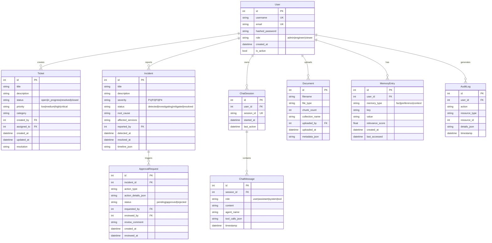

### LangGraph Agent Architecture

#### Supervisor Graph (Core Orchestration)

```mermaid
graph TD
    START([START]) --> Supervisor
    
    Supervisor["🧠 Supervisor Node<br/>─────────────<br/>• Receives user message<br/>• Loads memory context<br/>• Detects intent<br/>• Routes to specialist"]
    
    Supervisor -->|"intent: knowledge_query"| RAG["📚 RAG Agent<br/>─────────────<br/>• Searches Qdrant<br/>• Retrieves relevant chunks<br/>• Generates grounded answer"]
    
    Supervisor -->|"intent: ticket_operation"| Ticket["🎫 Ticket Agent<br/>─────────────<br/>• Creates/updates tickets<br/>• Queries ticket status<br/>• Assigns tickets"]
    
    Supervisor -->|"intent: incident_investigation"| Incident["🔥 Incident Agent<br/>─────────────<br/>• Gathers evidence<br/>• Calls logs/metrics tools<br/>• Invokes RCA sub-agent"]
    
    Supervisor -->|"intent: general_chat"| DirectResponse["💬 Direct Response<br/>─────────────<br/>• Simple Q&A<br/>• Greetings<br/>• Help text"]
    
    RAG --> MemoryUpdate["🧠 Memory Update<br/>─────────────<br/>• Save to short-term<br/>• Extract facts → long-term<br/>• Update semantic memory"]
    
    Ticket --> MemoryUpdate
    DirectResponse --> MemoryUpdate
    
    Incident --> NeedApproval{"Need Approval?"}
    
    NeedApproval -->|"Yes"| ApprovalNode["✋ Approval Agent<br/>─────────────<br/>• Create approval request<br/>• INTERRUPT execution<br/>• Wait for human review"]
    
    NeedApproval -->|"No"| Execute["⚡ Execute Action<br/>─────────────<br/>• Run remediation<br/>• Update ticket<br/>• Log action"]
    
    ApprovalNode -->|"Approved"| Execute
    ApprovalNode -->|"Rejected"| Rejected["❌ Action Rejected<br/>─────────────<br/>• Notify user<br/>• Log rejection<br/>• Suggest alternatives"]
    
    Execute --> MemoryUpdate
    Rejected --> MemoryUpdate
    
    MemoryUpdate --> END([END])
```

#### Agent State Definition

```python
# This is the shared state that flows through the LangGraph graph
from typing import TypedDict, Annotated, Literal
from langgraph.graph import add_messages

class AgentState(TypedDict):
    # Core conversation
    messages: Annotated[list, add_messages]      # Chat history (auto-appended)
    
    # Routing
    intent: str                                    # Detected intent
    current_agent: str                            # Which agent is active
    
    # Context
    user_id: int                                  # Authenticated user
    session_id: str                               # Chat session
    memory_context: dict                          # Retrieved memories
    
    # RAG
    retrieved_documents: list[dict]               # Retrieved chunks
    
    # Incident
    incident_id: int | None                       # Active incident
    evidence: list[dict]                          # Gathered evidence
    root_cause: str | None                        # RCA result
    recommended_action: dict | None               # Proposed fix
    
    # Approval
    needs_approval: bool                          # Whether HITL needed
    approval_status: str | None                   # pending/approved/rejected
    
    # Output
    final_response: str                           # Response to user
```

### Memory Architecture (Three-Tier)

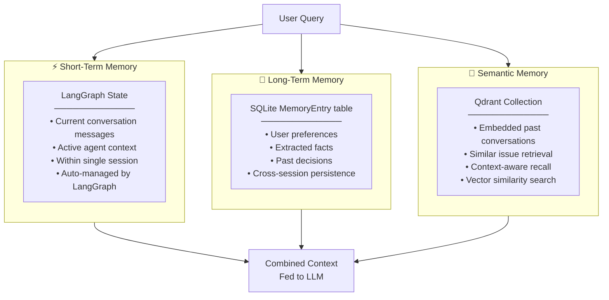

### MCP Integration Design

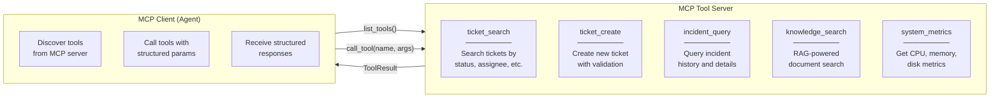

> [!IMPORTANT]  
> **MCP Concept**: Model Context Protocol standardizes how LLMs discover and call tools. Instead of hard-coding tools into agents, MCP lets any agent discover available tools at runtime — just like USB lets any device plug into any computer. We'll implement a simple MCP server that exposes our tools, and agents will consume them via MCP client.

### A2A Protocol Design

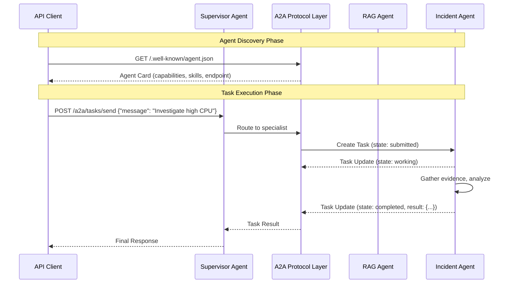

> [!IMPORTANT]
> **A2A Concept**: Google's Agent-to-Agent protocol defines how agents discover each other (via Agent Cards at `/.well-known/agent.json`) and exchange tasks. Each agent publishes an Agent Card describing its capabilities, and other agents can send it tasks. This is like a "LinkedIn for agents" — agents advertise what they can do and accept work requests.

### Tool Design

Each tool follows this pattern — making them compatible with both LangChain `@tool` decorator and MCP:

```python
# Pattern: Every tool is a simple function with clear input/output
from langchain_core.tools import tool
from pydantic import BaseModel, Field

class TicketSearchInput(BaseModel):
    """Input for searching tickets."""
    query: str = Field(description="Search query for tickets")
    status: str | None = Field(default=None, description="Filter by status")
    limit: int = Field(default=5, description="Max results")

@tool(args_schema=TicketSearchInput)
def search_tickets(query: str, status: str | None = None, limit: int = 5) -> str:
    """Search support tickets by query text and optional status filter."""
    # Implementation here
    ...
```

---

## Request Flow Diagrams

### Flow 1: Knowledge Query (RAG)

> **User asks**: *"How do I restart a Kubernetes pod that's stuck in CrashLoopBackOff?"*

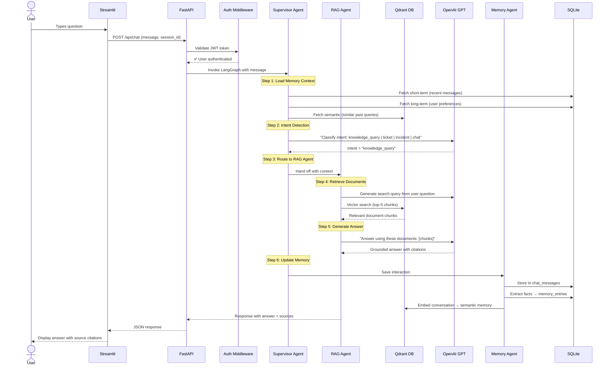

### Flow 2: Incident Investigation (Multi-Step Agent)

> **User asks**: *"We have a P1 incident — the payment service is down. Investigate and suggest a fix."*

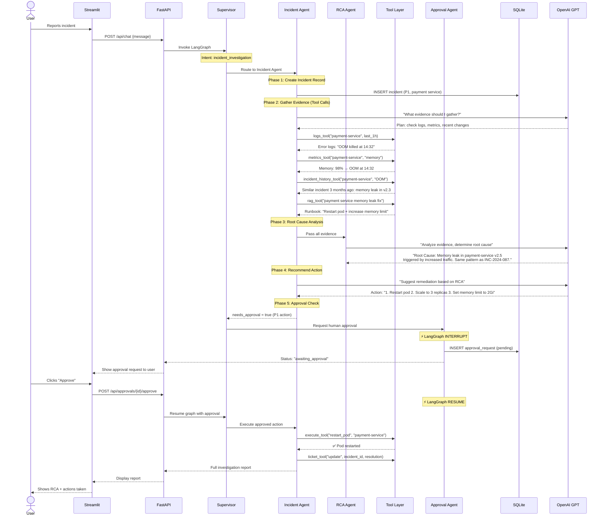

### Flow 3: Ticket Management

> **User asks**: *"Create a ticket: Database backup failing on prod-db-01, high priority"*

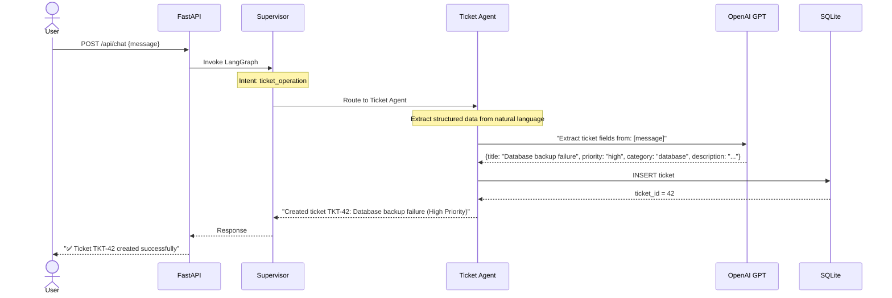

### Flow 4: A2A Agent Communication

> **External agent** wants to use our Incident Agent's capabilities.

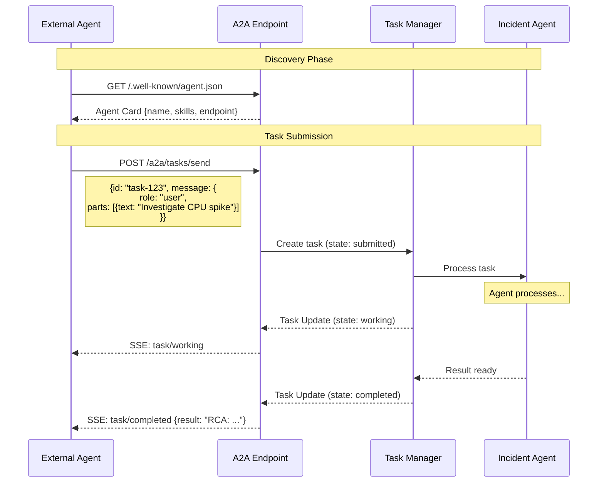

---

## Implementation Phases

> [!TIP]
> Each phase is self-contained and testable. You'll have a working system after each phase, progressively adding capabilities.

### Phase 1: Foundation (FastAPI + Database)
**Concepts**: Project setup, FastAPI, SQLAlchemy ORM, Pydantic schemas

| Step | File | What You'll Build |
|------|------|-------------------|
| 1.1 | `requirements.txt`, `.env.example` | Dependencies + environment config |
| 1.2 | `app/config.py` | Centralized settings with pydantic-settings |
| 1.3 | `app/db/database.py` | SQLAlchemy engine, session factory |
| 1.4 | `app/db/models.py` | All ORM models (User, Ticket, Incident, etc.) |
| 1.5 | `app/schemas/` | Pydantic request/response models |
| 1.6 | `app/main.py` | FastAPI app with CORS, lifespan events |
| 1.7 | `app/routes/tickets.py` | Basic CRUD endpoints for tickets |
| 1.8 | `app/db/seed.py` | Seed sample data for testing |

**Milestone**: API running at `localhost:8000` with ticket CRUD working.

---

### Phase 2: RAG Pipeline
**Concepts**: Document chunking, embeddings, vector search, retrieval strategies

| Step | File | What You'll Build |
|------|------|-------------------|
| 2.1 | `app/rag/chunker.py` | Recursive text splitting with overlap |
| 2.2 | `app/rag/embedder.py` | OpenAI embeddings wrapper |
| 2.3 | `app/rag/ingestion.py` | Upload → chunk → embed → store pipeline |
| 2.4 | `app/rag/retriever.py` | Qdrant vector search with score filtering |
| 2.5 | `app/routes/documents.py` | Document upload endpoint |
| 2.6 | `data/sample_docs/` | Sample IT runbooks for testing |

**Milestone**: Upload a document, search it via API, get relevant chunks back.

---

### Phase 3: First Agent (RAG Agent with LangGraph)
**Concepts**: LangGraph basics, tool-calling agent, state management

| Step | File | What You'll Build |
|------|------|-------------------|
| 3.1 | `app/agents/state.py` | AgentState TypedDict definition |
| 3.2 | `app/tools/rag_tool.py` | RAG search as a LangChain tool |
| 3.3 | `app/agents/rag_agent.py` | LangGraph agent that uses RAG tool |
| 3.4 | `app/routes/chat.py` | Chat endpoint invoking agent |

**Milestone**: Chat with the agent, it searches your documents and answers questions.

---

### Phase 4: Multi-Agent Supervisor
**Concepts**: Supervisor pattern, conditional routing, intent detection, specialized agents

| Step | File | What You'll Build |
|------|------|-------------------|
| 4.1 | `app/tools/ticket_tool.py` | Ticket CRUD tools |
| 4.2 | `app/tools/incident_tool.py` | Incident history query tool |
| 4.3 | `app/tools/logs_tool.py` | Simulated log search tool |
| 4.4 | `app/tools/metrics_tool.py` | Simulated metrics query tool |
| 4.5 | `app/agents/ticket_agent.py` | Ticket management agent |
| 4.6 | `app/agents/incident_agent.py` | Incident investigation agent |
| 4.7 | `app/agents/rca_agent.py` | Root cause analysis sub-agent |
| 4.8 | `app/agents/supervisor.py` | Full supervisor with intent routing |

**Milestone**: Chat with the supervisor — it detects intent and routes to the right agent.

---

### Phase 5: Memory System
**Concepts**: Three-tier memory, conversation persistence, semantic recall

| Step | File | What You'll Build |
|------|------|-------------------|
| 5.1 | `app/memory/short_term.py` | Conversation buffer using LangGraph state |
| 5.2 | `app/memory/long_term.py` | SQLite-backed persistent memory |
| 5.3 | `app/memory/semantic.py` | Qdrant-backed semantic memory |
| 5.4 | `app/agents/memory_agent.py` | Memory agent (save/retrieve/forget) |
| 5.5 | Update `supervisor.py` | Integrate memory loading into graph |

**Milestone**: Agent remembers user preferences and past conversations across sessions.

---

### Phase 6: Human-in-the-Loop (Approval Workflow)
**Concepts**: LangGraph interrupt/resume, approval workflows, breakpoints

| Step | File | What You'll Build |
|------|------|-------------------|
| 6.1 | `app/agents/approval_agent.py` | Approval node with LangGraph `interrupt()` |
| 6.2 | `app/routes/approvals.py` | Approval management endpoints |
| 6.3 | Update `supervisor.py` | Add approval routing + graph persistence |
| 6.4 | LangGraph checkpointing | SQLite-based checkpoint saver |

**Milestone**: Agent proposes P1 incident fix → pauses → resumes after human approval.

---

### Phase 7: MCP Integration
**Concepts**: Model Context Protocol, tool servers, standardized tool discovery

| Step | File | What You'll Build |
|------|------|-------------------|
| 7.1 | `app/mcp/server.py` | MCP server exposing tools via stdio/SSE |
| 7.2 | `app/mcp/client.py` | MCP client for tool discovery + calling |
| 7.3 | Update agents | Agents consume tools via MCP client |

**Milestone**: Tools are discoverable and callable via MCP protocol.

---

### Phase 8: A2A Protocol
**Concepts**: Agent-to-Agent communication, Agent Cards, task lifecycle

| Step | File | What You'll Build |
|------|------|-------------------|
| 8.1 | `app/a2a/agent_card.py` | Agent Card JSON + discovery endpoint |
| 8.2 | `app/a2a/task_manager.py` | Task state machine (submitted → working → completed) |
| 8.3 | `app/a2a/protocol.py` | A2A message format + task routing |

**Milestone**: External agents can discover our agent's capabilities and send it tasks.

---

### Phase 9: Authentication & Production Hardening
**Concepts**: JWT, RBAC, rate limiting, error handling, audit logging

| Step | File | What You'll Build |
|------|------|-------------------|
| 9.1 | `app/auth/jwt_handler.py` | JWT token creation + verification |
| 9.2 | `app/auth/rbac.py` | Role-based access (admin/engineer/viewer) |
| 9.3 | `app/auth/routes.py` | Login, register, token refresh |
| 9.4 | Update `main.py` | Rate limiting middleware, error handlers |

**Milestone**: Secure API with JWT auth, role-based access, and rate limiting.

---

### Phase 10: Streamlit UI
**Concepts**: Frontend integration, session management, real-time chat

| Step | File | What You'll Build |
|------|------|-------------------|
| 10.1 | `streamlit_app.py` | Main app with sidebar navigation |
| 10.2 | `pages/1_💬_Chat.py` | Chat interface with streaming responses |
| 10.3 | `pages/2_🎫_Tickets.py` | Ticket CRUD UI |
| 10.4 | `pages/3_🔥_Incidents.py` | Incident dashboard |
| 10.5 | `pages/4_📄_Documents.py` | Document upload + RAG testing |
| 10.6 | `pages/5_⚙️_Admin.py` | User management, approval queue |

**Milestone**: Full working UI connecting to the backend.

---

### Phase 11: Testing
**Concepts**: Unit testing, mocking LLMs, integration tests, RAG evaluation

| Step | File | What You'll Build |
|------|------|-------------------|
| 11.1 | `tests/conftest.py` | Test fixtures, mock DB, mock LLM |
| 11.2 | `tests/test_auth.py` | Auth flow tests |
| 11.3 | `tests/test_rag.py` | RAG pipeline tests |
| 11.4 | `tests/test_agents.py` | Agent behavior tests |
| 11.5 | `tests/test_tools.py` | Tool function tests |
| 11.6 | `tests/test_api.py` | API endpoint integration tests |

**Milestone**: Full test suite with `pytest` passing.

---

### Phase 12: Observability
**Concepts**: LangSmith tracing, structured logging, audit trails

| Step | File | What You'll Build |
|------|------|-------------------|
| 12.1 | LangSmith integration | Trace all LLM calls and agent steps |
| 12.2 | Structured logging | JSON logging with correlation IDs |
| 12.3 | Audit log queries | Admin endpoints for audit log search |

**Milestone**: Full observability with LangSmith traces and audit logs.

---

## Open Questions

> [!IMPORTANT]
> Please review these questions — your answers will shape the implementation.

### 1. OpenAI API Key
Do you already have an OpenAI API key? We'll need one for:
- GPT-4o-mini (LLM calls — cost-effective for learning)
- text-embedding-3-small (embeddings)

### 2. Qdrant Setup Preference
For the vector database, which approach do you prefer?
- **In-memory Qdrant** (simplest — no Docker, data lost on restart, perfect for learning)
- **Qdrant Docker container** (persistent, requires Docker Desktop)
- **Qdrant Cloud free tier** (hosted, 1GB free, no setup)

### 3. Simulated vs. Real External Services
For tools like `logs_tool` and `metrics_tool`, should we:
- **Simulate** them with realistic fake data (recommended for learning — no external dependencies)
- **Connect** to real services (Elasticsearch, Prometheus, etc.)

### 4. LangSmith (Optional)
LangSmith provides excellent agent tracing/debugging. Do you want to set it up?
- **Yes** — need a free LangSmith API key from smith.langchain.com
- **Skip for now** — we'll add console-based tracing instead

### 5. Python Version
What Python version do you have installed? We need 3.11+ for best compatibility.

---

## Verification Plan

### Automated Tests
```bash
# Run full test suite
pytest tests/ -v --tb=short

# Run specific test modules
pytest tests/test_auth.py -v
pytest tests/test_rag.py -v
pytest tests/test_agents.py -v
```

### Manual Verification
- **Phase 1**: Hit ticket CRUD endpoints via Swagger UI at `localhost:8000/docs`
- **Phase 2**: Upload a document, verify chunks in Qdrant, search via API
- **Phase 3**: Chat with RAG agent, verify it cites documents
- **Phase 4**: Test different intents route to correct agents
- **Phase 5**: Verify memory persists across sessions
- **Phase 6**: Trigger approval flow, verify agent pauses and resumes
- **Phase 7**: Verify tools discoverable via MCP
- **Phase 8**: Test A2A agent card and task submission
- **Phase 9**: Verify JWT auth, RBAC, rate limiting
- **Phase 10**: Full UI walkthrough
- **Phase 12**: Review LangSmith traces for agent behavior
